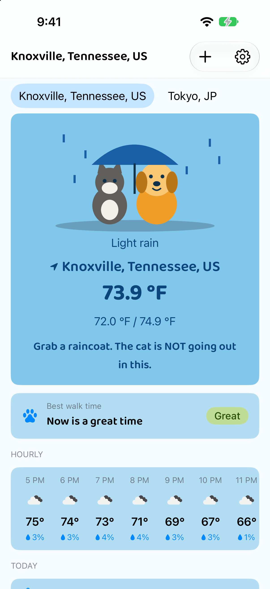
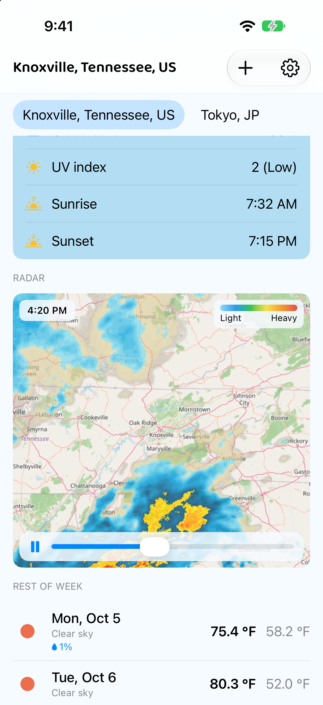
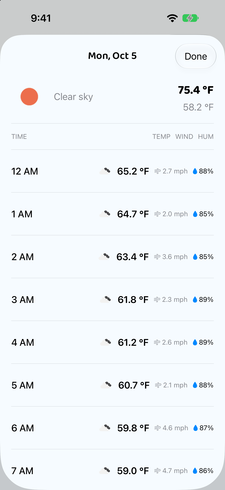
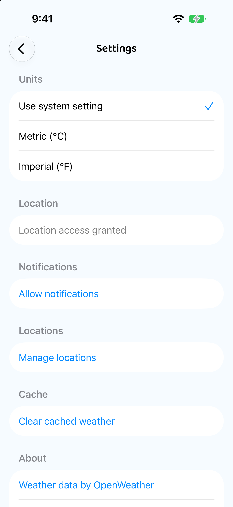
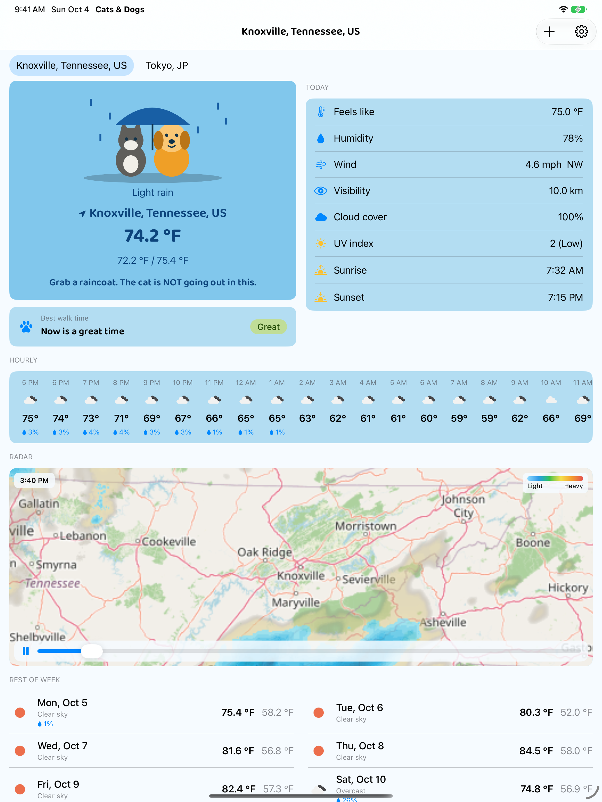

# Cats & Dogs (iOS)


Native SwiftUI port of the [Android Cats & Dogs weather app](https://github.com/tuckercr/cats-dogs).
Features generally land on Android first and iOS catches up — see [Feature parity](#feature-parity-with-android).

Save multiple cities (or use your current location) and see current conditions with a cat and dog
acting out the weather, the best time to walk the dog, an hourly and 7-day forecast, an animated
precipitation radar, and optional daily weather notifications.

## Screenshots

| Pets, walk time & hourly | Radar & rest of week | Day detail | Settings & units |
|---|---|---|---|
|  |  |  |  |

On iPad and in landscape, the pets sit beside today's details and the week splits into two columns:



## How to run

1. Get a free API key from [OpenWeatherMap](https://openweathermap.org/api).
2. Copy the secrets template:

   ```bash
   cp "Cats&Dogs/Secrets.example.plist" "Cats&Dogs/Secrets.plist"
   ```

3. Edit `Cats&Dogs/Secrets.plist` and replace `your_key_here` with your key.
4. Open `Cats&Dogs.xcodeproj` in Xcode and run on a simulator or device.

New API keys can take up to two hours to activate.

`Secrets.plist` is gitignored so your key is never committed.

Requires **iOS 17+**.

## App flow

1. **Splash** — a brief splash screen with the mascot.
2. **Welcome** — first launch only; tap **Get started**.
3. **Notification onboarding** — opt in to daily weather updates, or **Not now**.
4. **Location onboarding** — use the device location, or **Enter a city manually**.
5. **Current weather** — the main screen for the active city:
   - Hero card: the cat and dog act out one of 8 weather moods (sunny, cloudy, rain, storm, snow, hot,
     cold, night) on a mood-coloured card, with the city, temperature, min/max and a daily caption in
     the pets' voice. Tap it for today's hourly detail. The art is drawn in code as a placeholder,
     isolated in `PetScene`.
   - **Best walk time**: Great, Okay, Stay in, Paws hot or Too cold, with the first good window
     between 7 AM and 8 PM. Hot pavement (estimated 52 °C / 125 °F) counts as paws hot even on a
     mild day.
   - **Hourly**: the next 24 hours, with rain chance. Cities without coordinates fall back to
     OpenWeatherMap, which is 3-hourly, so the strip spans three days for them.
   - **Today**: feels like, humidity, wind, visibility, cloud cover, UV index (daytime only),
     sunrise and sunset.
   - **Radar**: RainViewer's recent radar frames animated over an OpenStreetMap base map, with the
     frame time, a Light→Heavy legend, play/pause and a scrubber.
   - **Rest of week**: one row per day (sample closest to local noon) with rain chance; tap a row
     for hourly detail.
   - All times — hours, days, sunrise/sunset, radar frames and "today" — are in the city's own time
     zone, not the device's.
   - On landscape phones and iPad the pets and walk card sit beside today's details, and the week
     splits into two columns.
   - City tabs appear under the title once two or more cities are saved.
   - Pull to refresh. Data also refreshes silently whenever the app returns to the foreground,
     and periodically in the background.
6. **Add city** (＋) — search with geocoding suggestions; choosing a suggestion pins exact coordinates.
   A name added without choosing a suggestion appears straight away and is geocoded in the background.
7. **Settings** (gear):
   - Units: system, metric, or imperial
   - Location and notification permission status. A permission that was never requested is requested
     in-app (iOS has no Settings entry for it yet); a denied one links to the iOS Settings app.
     Granting location here adds your current location as a city.
   - Manage locations: add, set active, reorder, delete
   - Clear cached weather
   - OpenWeather and Open-Meteo attribution, and [privacy policy](https://fangjet.com/privacy-policy)

### Where the data comes from

| Data | Source |
|---|---|
| Current conditions, city search | OpenWeatherMap (needs the API key) |
| Forecast for cities with coordinates | [Open-Meteo](https://open-meteo.com): true hourly data, UV index, and solar radiation for the pavement estimate. Free, no key. |
| Forecast for name-only cities | OpenWeatherMap's 3-hourly `/forecast`, as a fallback |
| Radar | [RainViewer](https://www.rainviewer.com/api.html) frames (free, no key) at zoom 7, the highest it serves |
| Base map | OpenStreetMap tiles |

Open-Meteo's weather codes are mapped onto OpenWeatherMap-style conditions and icons, so icons and
pet moods work the same for both sources.

### Caching and errors

The last successful current weather and forecast are cached per city in `UserDefaults`. Cached data
is shown immediately while a refresh runs, and is kept on screen if the refresh fails. Errors only
surface when there is nothing cached, with **Retry** where retrying can help (offline, rate limited,
server error) and without it where it cannot (bad API key, city not found).

### Background refresh and notifications

If allowed, the app schedules local notifications at **9 AM, 1 PM and 7 PM** for the active city.

Android runs a periodic `WeatherUpdateWorker` plus a `WeatherNotificationWorker` at each of those
hours. iOS cannot run code at a fixed time of day, so `WeatherBackgroundRefresher` does both jobs in
a single `BGAppRefreshTask`. Each time iOS grants background time it:

1. fetches current weather and the forecast for the active city,
2. writes them to the per-city cache, so the app opens with fresh data,
3. rewrites the three pending notifications with the fresh text, and
4. requests the next run — 30 minutes later (Android's default interval), or 15 after a failed fetch.

The notifications themselves stay on calendar triggers, so they always arrive on time; their text is
as fresh as the most recent background run. They are also rewritten whenever the app itself loads
new data. The fetch-then-notify decision logic is `NotificationWorkerLogic`, a direct port of the
Android class with the same tests.

> **iOS decides when background refresh runs.** The interval is a minimum, not a schedule: iOS
> learns from how often the app is opened, and runs nothing if the user force-quits the app or turns
> off *Background App Refresh*. Expect fresher notifications for regular users than for occasional ones.

Background tasks never fire on the simulator. To trigger one on a device, run from Xcode, send the
app to the background, pause in the debugger and enter:

```
e -l objc -- (void)[[BGTaskScheduler sharedScheduler] _simulateLaunchForTaskWithIdentifier:@"com.tuckercr.Cats-Dogs.refresh"]
```

The task identifier and the `fetch` background mode are declared in [`Cats&Dogs/Info.plist`](Cats&Dogs/Info.plist),
which Xcode merges with the generated Info.plist.

## Architecture

| Layer | Choice |
|---|---|
| UI | SwiftUI, `NavigationStack` |
| State | `@Observable` view models on the main actor |
| Networking | `URLSession` + `Codable` behind `OpenWeatherAPI`, `OpenMeteoAPI` and `GeocodingAPI` protocols, plus an injectable RainViewer fetch (all faked in tests) |
| Persistence | `UserDefaults` via `PreferencesStore` — onboarding flags, saved cities, unit override, weather cache |
| Location | Core Location (when-in-use) |
| Notifications | `UserNotifications` local calendar triggers |
| Background work | `BackgroundTasks` (`BGAppRefreshTask`) via SwiftUI `.backgroundTask` |
| APIs | OpenWeatherMap `/weather`, `/forecast` and Geocoding (free tier); Open-Meteo; RainViewer; OpenStreetMap tiles |
| Fonts | Baloo 2 for display and title text (SIL OFL, licence bundled) |
| Dependencies | None — Apple frameworks only |

```
Cats&Dogs/
  Config/      API key loading
  Data/        Repositories, PreferencesStore
  Domain/      Units and unit override
  Models/      Weather and radar models, SavedLocation, CitySuggestion, LoadingState
  Services/    API clients, DTOs, forecast aggregation, notifications, background refresh
  Resources/   Fonts
  Utilities/   Formatting, error messages, brand fonts and colours
  ViewModels/
  Views/       Screens; Pets/ holds the pet scene, moods and walk advice
```

## Feature parity with Android

| Feature | Android | iOS |
|---|---|---|
| Welcome, notification and location onboarding | ✅ | ✅ |
| Multiple saved cities, tabs, current location | ✅ | ✅ |
| City search with geocoding suggestions | ✅ | ✅ |
| Current conditions incl. sunrise / sunset and UV | ✅ | ✅ |
| Pet hero (8 weather moods, daily caption) | ✅ | ✅ |
| Best walk time card, incl. pavement heat | ✅ | ✅ |
| Hourly strip and rain chance | ✅ | ✅ |
| Open-Meteo forecast for cities with coordinates | ✅ | ✅ |
| All times in the city's own time zone | ✅ | ✅ |
| Rest of week + day detail sheet | ✅ | ✅ |
| Animated RainViewer radar | ✅ speed from Remote Config | ✅ fixed 850 ms per frame |
| Wide layout for landscape and tablets | ✅ | ✅ |
| Branding: brand blue, gold accent, Baloo 2, themed icon | ✅ | ✅ tinted icon on iOS 18+ |
| Per-city cache, silent refresh on foreground | ✅ | ✅ |
| Settings: units, permissions, clear cache, about | ✅ | ✅ |
| Manage locations: set active, reorder, delete | ✅ | ✅ |
| Daily notifications at 9 / 13 / 19 | ✅ fetched at send time | ✅ text from the latest background refresh |
| Periodic background weather refresh | ✅ WorkManager, every 30 min | ✅ `BGAppRefreshTask`, when iOS allows |
| Follows the OS temperature-unit preference | ✅ Android 14+ | ⚠️ region-based only |
| Analytics, Crashlytics, Remote Config (Firebase) | ✅ optional | ❌ |
| View-model unit tests | ✅ | ✅ |
| UI tests in CI | ✅ Compose UI tests | ❌ |
| Release minification | ✅ R8 | n/a |

## Tests

Unit tests live in the `Cats&DogsTests` target (XCTest). Run them in Xcode with **⌘U**, or from the
Test navigator.

Ported from Android:

- `ForecastAggregatorTests` — noon slot selection, multi-day grouping, rain chance, local hour, UV
- `OpenWeatherParsingTests` — JSON decoding for API responses, including UTC offsets and rain chance
- `WeatherUnitsTests` — imperial vs metric by region, Celsius conversion
- `WeatherRepositoryTests` — repository mapping and error handling (fake API)
- `GeocodingRepositoryTests` — suggestion formatting and validation (fake API)
- `NotificationWorkerLogicTests` — notification content, permission and retry behaviour, "today" in the city's time zone
- `OpenMeteoForecastTests` — hour filtering, city time zones (including half-hour zones and DST), WMO codes, UV, pavement heat
- `RadarTests` — RainViewer timeline parsing, tile URLs, load-once and retry
- `PetMoodTests`, `WalkAdvisorTests` — mood mapping, walk ratings including night hours and pavement heat
- `CityListViewModelTests` — loading and legacy migration, add (with geocoding and de-duplication), remove, set active, reorder
- `WeatherForecastViewModelTests` — request routing, cache-first display, error mapping, silent background refresh, and races between overlapping requests
- `GeoLocationViewModelTests` — debounced search, latest-input-wins, suggestion pinning, reset
- `LocationPermissionViewModelTests` — denied, located and failed states
- `SettingsViewModelTests` — unit override persistence, clear cache, permission requests
- `WelcomeViewModelTests` — onboarding flags, including installs that predate the notification step

iOS only:

- `WeatherBackgroundRefresherTests` — background refresh caching, notification rescheduling and retry timing
- `PreferencesStoreTests` — per-city cache round trip, eviction when a city is removed, older cache format
- `WeatherFormattingTests` — sunrise/sunset in the city's time zone, UV categories

View-model tests run against real repositories with scripted API fakes, and a `PreferencesStore` backed
by a throwaway `UserDefaults` suite, so they never touch the app's real data. Shared helpers (including
`Gate`, which holds fake requests open so tests can control the order responses arrive in) live in
`ViewModelTestSupport.swift`.

## CI

GitHub Actions runs on every push and pull request to `main` (see [`.github/workflows/ios.yml`](.github/workflows/ios.yml)).

The workflow builds the app with Xcode 16.4, runs the unit tests on an iOS 18 simulator, and uploads
the `.xcresult` bundle as an artifact for inspecting failures.

The app targets **iOS 17+** so unit tests can run on the simulator runtimes preinstalled on GitHub-hosted Mac runners.

Add the same OpenWeather API key used for Android as a repository secret:

1. GitHub repo → **Settings** → **Secrets and variables** → **Actions**
2. Create secret **`OWM_API_KEY`** with your key

At build time the workflow writes that value into `Secrets.plist` (the file stays gitignored locally).

## Credits

Weather data by [OpenWeather](https://openweathermap.org/) and [Open-Meteo.com](https://open-meteo.com)
(CC BY 4.0). Radar by [RainViewer](https://www.rainviewer.com). Base map ©
[OpenStreetMap](https://www.openstreetmap.org/copyright) contributors. [Baloo 2](https://github.com/EkType/Baloo2)
by Ek Type, under the SIL Open Font License.
